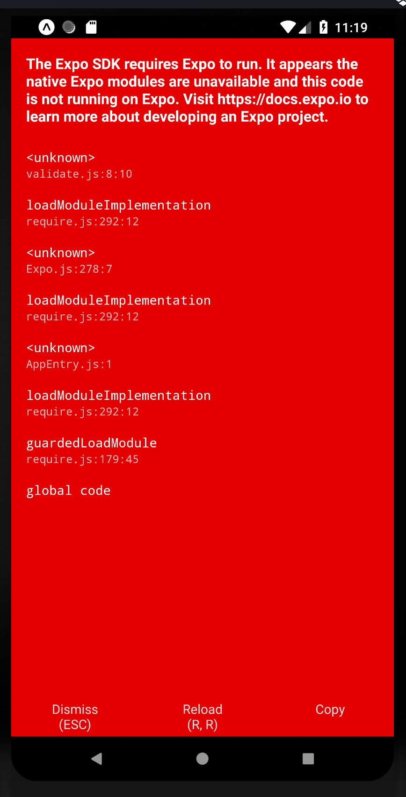

# Repro Issue with Expo Firebase App

I created this repo for a minimal issue I am getting when trying to add `expo-firebase-app` to my Expo app. 

I followed the instructions here: https://www.npmjs.com/package/expo-firebase-app

And I got this issue:

Something is breaking the Expo linking

# UPDATE

I fixed the expo-firebase config. It turns out I should have been updating getExpoPackages in `MainApplication.java` instead of `MainActivity.java`. This repo should work now...

The commit that added this comment also fixed the repo. 

I will now try to get React Native IAP working...
